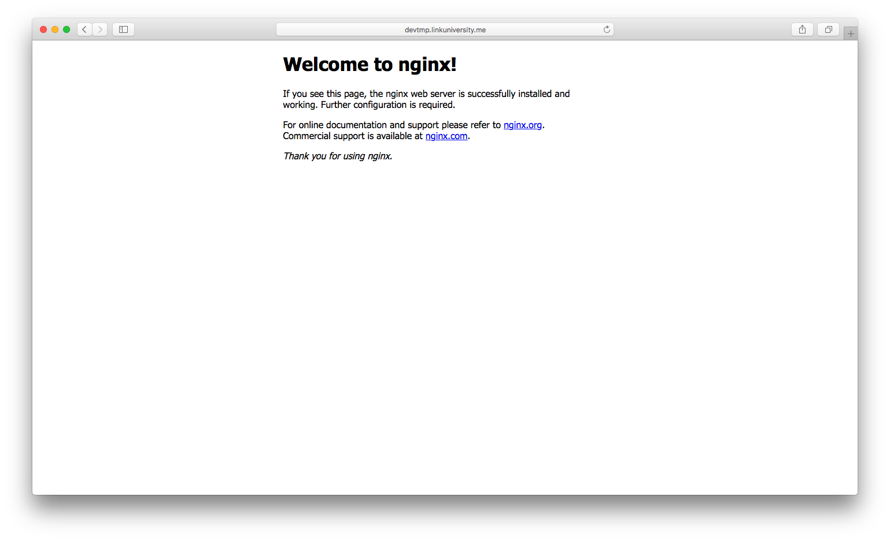

# Django nignx 연동 가이드
장고 nginx 연동을 위한 한국어 가이드 기초편입니다. 소켓을 사용하지 않는 쉬운 방법으로 웹 서버를 가동합니다.

### Version
- Ubuntu 16.04
- Python: 3.5.2 
- Django: 2.2.0


### 가정
Virtualenv와 Pyenv는 설정이 완료되었음을 가정합니다.

### nginx
```sh
$ sudo apt-get install nginx
```
nginx를 설치합니다. apt-get으로 nginx 설치 시 /etc/nginx 디렉토리에 nginx 설정 파일들이 존재합니다.
```sh
$ nginx -v
```
nginx의 버전을 확인합니다.

```sh
$ sudo service nginx start
$ sudo systemctl start nginx
$ sudo /etc/init.d/nginx start
```
nginx를 가동합니다.(3개의 명령어 중에 선택)
```sh
$ sudo service nginx restart
$ sudo systemctl restart nginx
$ sudo /etc/init.d/nginx restart
```
nginx를 재가동합니다.(3개의 명령어 중에 선택)

```sh
$ sudo service nginx stop
$ sudo systemctl stop nginx
$ sudo /etc/init.d/nginx stop
```
nginx 가동 중지합니다.(3개의 명령어 중에 선택)
```sh
$ sudo service nginx status
$ sudo systemctl status nginx
```
nginx 상태를 확인합니다. (2개의 명령어 중에 선택)
```sh
$ sudo service nginx reload
$ sudo systemctl reload nginx
$ sudo nginx -s reload
```
nginx의 설정을 reload합니다. (3개의 명령어 중에 선택)
```sh
$ sudo nginx -t
```
구성 파일의 문법을 점검합니다.
### nginx 구동 여부 확인하기
nginx 시작 명령을 통해서 웹서버를 가동하고 본인의 IP를 입력하면 다음과 같은 화면이 나옵니다.


### nginx 설정

###### <프로젝트명>.conf
```sh
# upstream(proxy) 설정
upstream django {
	# 장고 서버가 listen할 IP와 사용할 내부 포트.
	# listen할 IP는 장고 프로젝트의 settings.py의 ALLOWED_HOSTS에 등록되어야합니다.
        # listen할 IP는 보통 127.0.0.1로 localhost로 합니다. 
	server <장고 서버가 listen할 IP>:<내부 포트>;
}

# 서버 설정
server {
	# 외부 포트
	listen <외부 포트>;
	
	# 현재 PC의 내부 IP(192.168.~~~)
	# 공유기를 사용하지 않는다면 공인 IP를 적으세요
	server_name <IP>;

	location / {
		# upstream(proxy)의 블록 이름
		uwsgi_pass <블록 이름>;
        	
		# 맞는 url이 왔을 경우 upstream이 처리할 수 있도록 설정 합니다.
        	# upstream과 같은 값이여야합니다.
        	proxy_pass <장고 서버가 listen할 IP>:<내부 포트>;
		
		# uwsgi_params의 경로(고정 값)
		include /etc/nginx/uwsgi_params;
	}

	location /static {
		# manager.py collectstatic 실행 시 static 파일들의 디렉토리 위치
		alias <static 파일들의 디렉토리>;
	}
}

```
/etc/nginx/sites-available에 연동할 장고 프로젝트에 대한 설정파일을 생성합니다. 보통 프로젝트명.conf입니다.

```sh
$ sudo ln -s /etc/nginx/sites-available/<프로젝트명>.conf /etc/nginx/sites-enabled/
```
/etc/nginx/sites-enabled에 sites-available의 설정 파일에 대한 symlink를 추가합니다.
### uwsgi
```sh
$ pip3 install uwsgi
```
uwsgi를 가상환경에서 설치합니다.
```sh
$ uwsgi --http :<포트 번호> --module <디렉토리 이름>.wsgi
```
http는 http 통신을 하겠다는 의미입니다. 포트 번호는 80번이 아니여도 됩니다. module은 wsgi 모듈을 통해 실행하겠다는 의미입니다.
포트 번호는 장고와 nginx를 연결할 때 장고에서 내보낼 내부 포트의 번호입니다. conf 파일의 상단 포트번호와 같아야합니다.
디렉토리 이름은 장고 프로젝트 내에 wsgi.py 파일을 포함하고 있는 폴더 명으로 설정합니다. 이 명령은 python3 manage.py runserver와 같습니다.

### django 설정

###### 프로젝트를 git에서 가져와야하는 경우(선택)
```sh
$ git clone https://<당신의 git repository>
```
git에서 프로젝트를 clone 합니다.
```sh
$ python3 manage.py makemigrations;
$ python3 manage.py migrate;
```
DB 설정을 위해 migration합니다.
###### cllectstatic
```sh
python3 manage.py collectstatic
```
js,css와 같은 정적 파일들을 분리합니다. 이를 통해 만들어진 디렉토리를 conf 파일의 location /static에 설정합니다.
###### settings.py
settings.py의 ALLOWED_HOSTS에 장고 서버가 listen할 IP를 등록(보통 localhost)하고 DEBUG 옵션을 False로 수정합니다. ALLOWED_HOSTS에 아무 값이 없을 경우 이는 어떤 IP도 접근 할수 없음을 의미합니다. localhost로 지정하면 디버깅 모드가 아닌 경우 로컬에서도 접근이 가능합니다. STATIC_ROOT = os.path.join(BASE_DIR, 'static')
를 설정하여 collectstatic 하여 모여진 static 파일들을 설정합니다.

### 웹서버 구동 시작하기
```sh
$ sudo service nginx start
```
nginx를 구동합니다.
```sh
$ uwsgi --http :<포트 번호> --module <디렉토리 이름>.wsgi
```
장고 프로젝트를 실행합니다.

### 공유기를 사용하는 경우(포트 포워딩)
공유기를 사용하여 서버를 돌릴 경우 포트 포워딩을 해야합니다. 예를 들어 현재 장고 프로젝트에서 uwsgi 명령어를 통해서 설정한 내부포트 번호(conf 파일의 upstream django 안의 내부포트와 같음)가 8001번이고 upstream의 IP가 localhost이고 conf 파일에서 listen 외부 포트를 80번이라고 가정합니다. 또한 conf 파일에서 server_name에 내부 IP를 설정했다고 가정합니다. 예시와 같은 상황에서는 서버를 운용하는 컴퓨터의 공인 IP의 특정 포트로 접근할 경우 공유기에서 포트 포워딩을 통해서 공인 IP로 접근하고 있는 특정 포트를 포워딩하여 사용하고 있는 내부 IP와 80번 포트로 포워딩을 설정해야 conf 파일을 통해서 장고의 8001번 포트와 연동이 됩니다. 장고의 uwsgi <--> nginx|nginx <--> 서버 컴퓨터의 공인IP (== localhost:8001번 <--> 내부IP:80번 | 내부IP:80번 <--> 공인IP:특정포트)와 같은 구조입니다.

### 공유기를 사용하지 않는 경우
공유기를 사용하지 않을 경우 포트 포워딩 작업이 없습니다. 예를 들어 현재 장고 프로젝트에서 uwsgi 명령어를 통해서 설정한 내부포트 번호(conf 파일의 upstream django 안의 내부포트와 같음)이 8001번이고 upstream의 IP가 localhost이고 conf 파일에서 listen 외부 포트를 80번이라고 가정합니다. 또한 conf 파일에서 sever_name에 공인 IP를 설정했다고 가정합니다. 예시와 같은 상황에서는 서버를 운용하는 컴퓨터의 공인 IP의 특정 포트로 접근할 경우 바로 장고 서버와 연동이 됩니다. 장고의 uwsgi <--> nginx  <--> 서버 컴퓨터의 공인 IP  (== localhost:8001번 <--> 공인IP:80번 | 공인IP:80번 <--> 공인IP:80) 공유기를 사용하지 않는 경우 내부 IP가 없기 때문에 사용하고 있는 컴퓨터의 IP는 공인 IP 1개입니다.

### 로컬 서버만을 돌리는 방법(같은 WIFI에 묶여있는 경우에만 접근)
로컬 서버만으로 돌리려고 하는 경우 conf 파일의 셋팅은 똑같다. 서버 컴퓨터의 내부IP를 고정하고 다른 기기에서는 서버 컴퓨터의 내부IP와 listen된 포트로 접근하면 된다.


